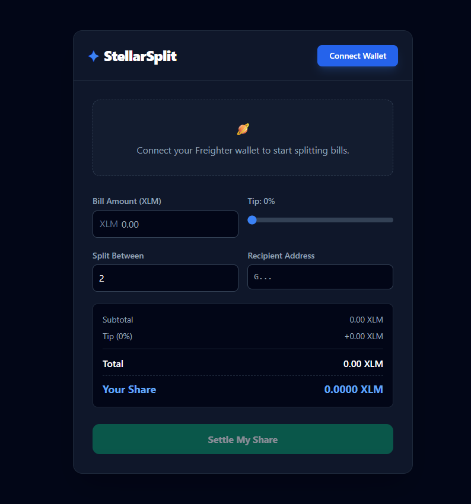
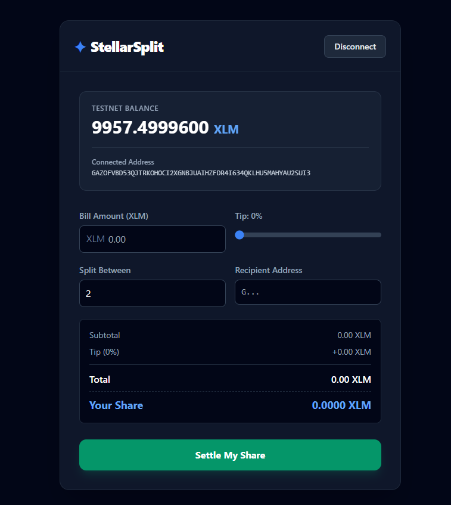
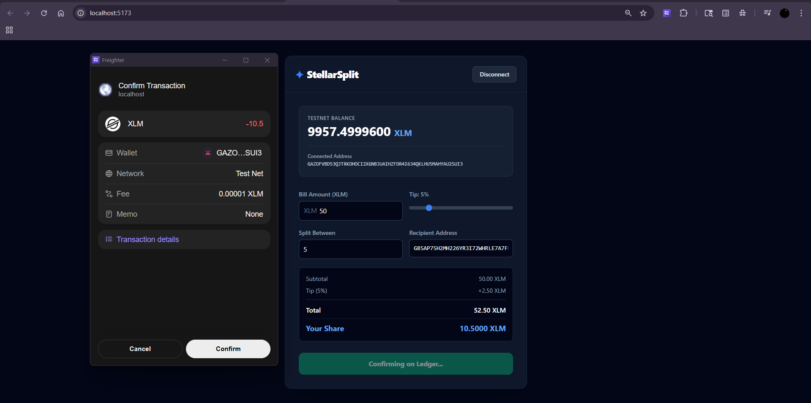
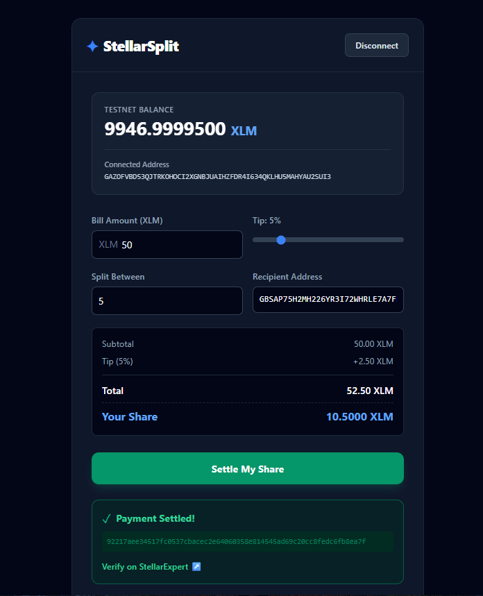
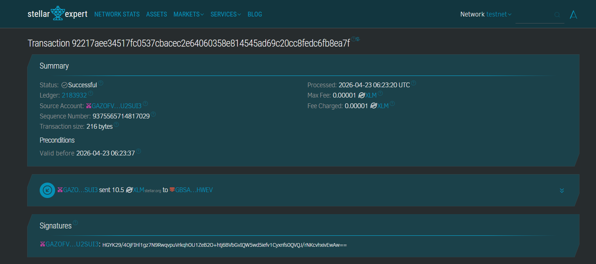

# StellarSplit: Split Bill Calculator 🪐

A sleek, dark-themed decentralized application (dApp) built for **Stellar Level 1 - White Belt**. StellarSplit allows users to seamlessly connect their Freighter wallet, view their Testnet XLM balance, calculate tips, and settle their share of a bill directly on the Stellar Testnet.

## 🚀 Features
- **Wallet Integration:** Securely connect and disconnect using the Freighter browser extension.
- **Real-time Balance:** Automatically fetches and displays your current Testnet XLM balance.
- **Smart Calculator:** Includes a tip slider and provides a receipt-style breakdown (Subtotal, Tip, Total, Your Share).
- **On-Chain Settlement:** Sends XLM payments securely on the Stellar Testnet.
- **Transaction Feedback:** Displays clear success/error states along with the transaction hash and a direct link to verify on StellarExpert.
- **Modern UI:** Premium dark mode interface built with Tailwind CSS.

## 🛠️ Setup Instructions (Local Development)

Follow these steps to run the project locally on your machine:

### Prerequisites
- [Node.js](https://nodejs.org/) (LTS version recommended)
- [Freighter Wallet Extension](https://www.freighter.app/) installed in your browser and set to **Testnet**.

### Installation & Execution
1. **Clone the repository**:
   ```bash
   git clone https://github.com/Aritra-Roy-O6/StellarSplit
   cd stellarsplit


**ScreenShots**

Initial state:



Wallet Connected:



Payment Process:



Payment Done:



Stats on stellar expert:

